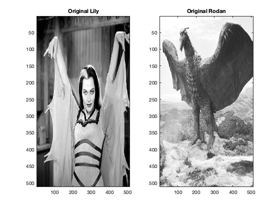
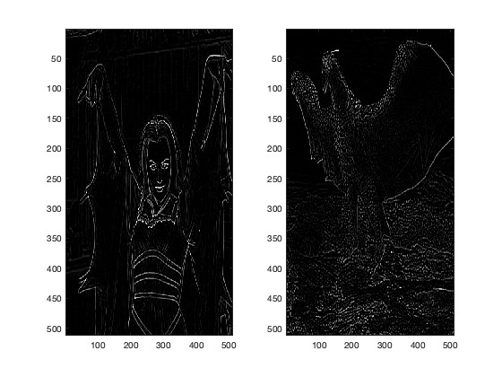
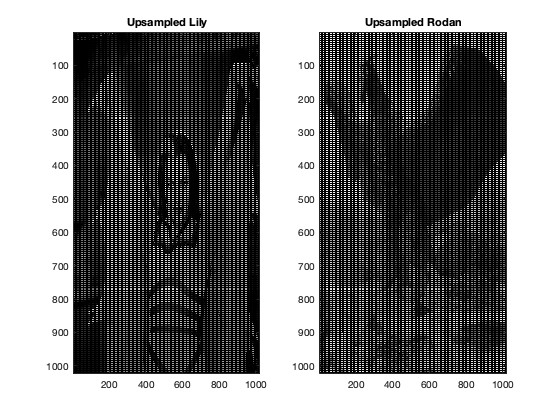
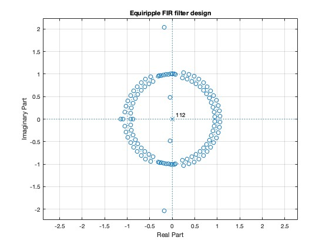
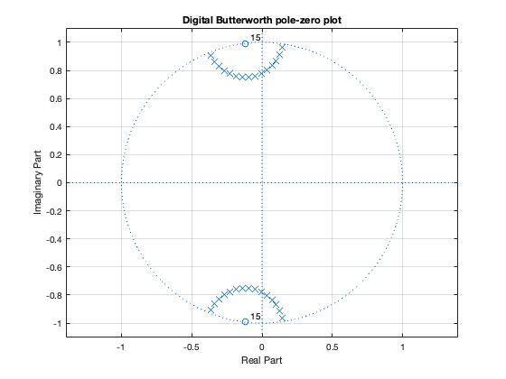
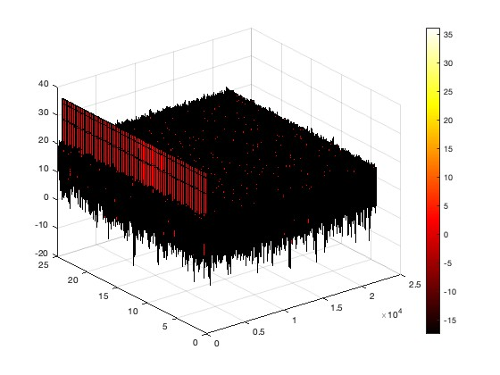

# Digital Signal Processing Projects

This repository contains four MATLAB projects focusing on various aspects of Digital Signal Processing (DSP). Each project demonstrates different concepts and techniques in DSP.

## Table of Contents
1. [Discrete Fourier Transform (DFT) and Image Processing](#DFTsampling)
2. [Filter Design](#filter-design)
3. [Multirate Systems](#multirate-systems)
4. [Quantization](#quantization)
5. [Spectral Analysis and Sampling](#spectral-analysis-and-sampling)

## Discrete Fourier Transform (DFT) and Image Processing

### Description
This project explores the application of the Discrete Fourier Transform (DFT) in image processing and spectral analysis. It demonstrates the use of DFT for analyzing image frequency content and implements various image processing techniques.

### Key Features
- Implementation of 2D DFT for image analysis
- Image filtering using Laplacian and Laplacian of Sobel operators
- Visualization of frequency domain representations of images
- Image upsampling and its effects on the frequency domain
- Analysis of phase distortion in image processing

### Graphs

## Filter Design

### Description
This project focuses on designing various types of digital filters, including Butterworth, Chebyshev Type I and II, and Elliptic filters. It also explores FIR filter design using the Kaiser window and Equiripple methods.

### Key Features
- Implementation of IIR filters (Butterworth, Chebyshev I & II, Elliptic)
- FIR filter design using Kaiser window and Equiripple methods
- Comparison of filter characteristics (magnitude response, phase response, etc.)
- Analysis of passband variation and stopband attenuation

### Graphs

## Multirate Systems

### Description
This project explores multirate systems, focusing on wavelet filters and their properties. It demonstrates the use of Daubechies wavelets and analyzes their characteristics in multirate systems.

### Key Features
- Implementation of Daubechies wavelet filters
- Analysis of filter bank properties (perfect reconstruction, etc.)
- Visualization of magnitude responses for analysis and synthesis filters
- Study of polyphase decomposition

<!-- ### Graphs
[Place for wavelet filter response graphs] -->

## Quantization

### Description
This project deals with the effects of quantization in digital filter implementation. It focuses on the design and analysis of elliptic filters and explores different second-order section (SOS) orderings.

### Key Features
- Design of elliptic bandpass filters
- Conversion to second-order sections (SOS)
- Analysis of different SOS orderings (up and down)
- Visualization of magnitude responses for different sections

## Spectral Analysis and Sampling

### Description
This project covers various aspects of spectral analysis and sampling. It includes DFT analysis, window functions, and spectral estimation techniques.

### Key Features
- DFT analysis of sinusoidal signals
- Comparison of rectangular and Chebyshev windows
- Noise analysis and SNR considerations
- Spectral analysis using periodogram and spectrogram
- Music note analysis using DSP techniques

### Graphs

## How to Use
1. Clone this repository
2. Open MATLAB and navigate to the project directory
3. Run each `.m` file to see the results and graphs

## Requirements
- MATLAB (version used: [specify your MATLAB version])
- Signal Processing Toolbox

## Author
Lei (Raymond) Chi
